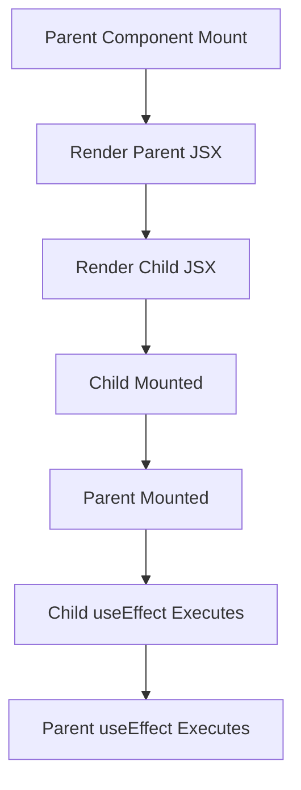

# React Component Lifecycle: Mount & useEffect

In React, when a component mounts and JSX renders, the order of execution is as follows:

---

## Mount Steps

1. **Parent Component Mount**
   - The parent component function runs.
   - State and props are initialized.
2. **Render Parent JSX**
   - Parent JSX is prepared.
   - It is not yet added to the DOM.
3. **Render Child JSX**
   - All child JSX inside the parent executes.
4. **Child Mounted**
   - Child is added to the DOM.
5. **Parent Mounted**
   - Parent is added to the DOM after its children.
6. **Child useEffect Executes**
   - All `useEffect` hooks in children run after mount and paint.
7. **Parent useEffect Executes**
   - `useEffect` hooks in the parent run after all child effects.

---

## Mermaid Diagram

