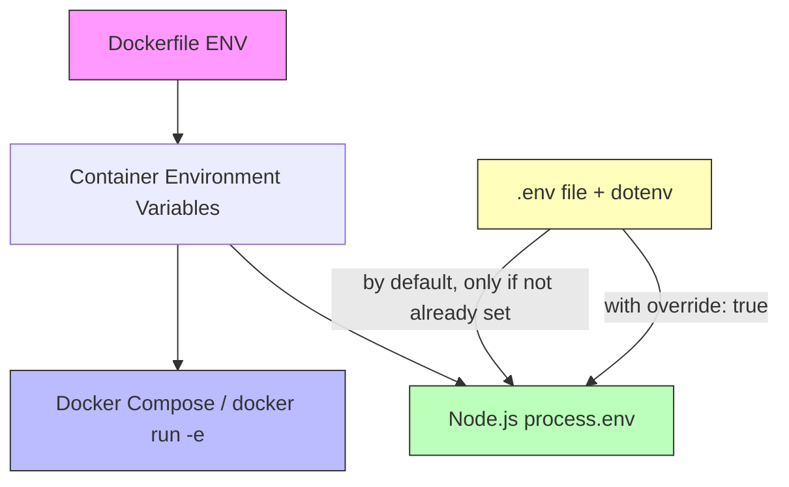

```mermaid
flowchart TD
    A[Dockerfile ENV] --> B[Container Environment Variables]
    B --> C[Docker Compose / docker run -e]
    B --> D[Node.js process.env]
    E[.env file + dotenv] -->|by default, only if not already set| D
    E -->|with override: true| D

    style A fill:#f9f,stroke:#333,stroke-width:1px
    style C fill:#bbf,stroke:#333,stroke-width:1px
    style E fill:#ffb,stroke:#333,stroke-width:1px
    style D fill:#bfb,stroke:#333,stroke-width:1px
```
