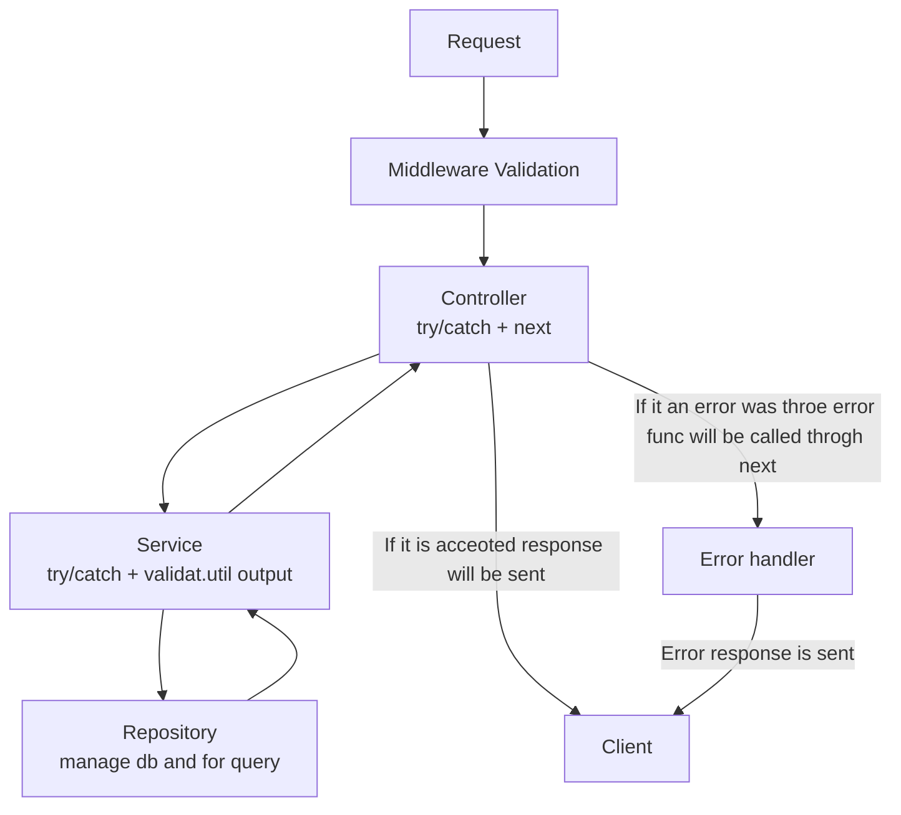

```mermaid
flowchart TD
    A[Request] --> B[Middleware Validation]
    B --> C[Controller<br>try/catch + next]
    C -->D[Service<br>try/catch + validat.util output]
    D -->E[Repository<br>manage db and for query]

    E-->D
    D-->C


    C -->|If it is acceoted response will be sent| G[Client]
    C -->|If it an error was throe error func will be called throgh next| M[Error handler]
    M-->|Error response is sent |G

```
