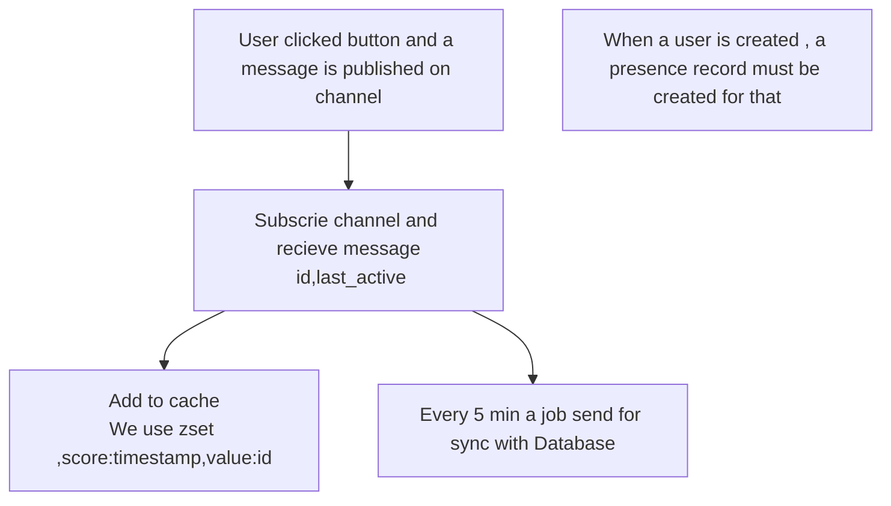

```mermaid
flowchart TD
    A[User clicked button and a message is published on channel] --> B[Subscrie channel and recieve message<br> id,last_active]
    B-->C[Add to cache<br>We use zset ,score:timestamp,value:id]
    B-->D[Every 5 min a job send for sync with Database]

    E[When a user is created , a presence record must be created for that]
```
