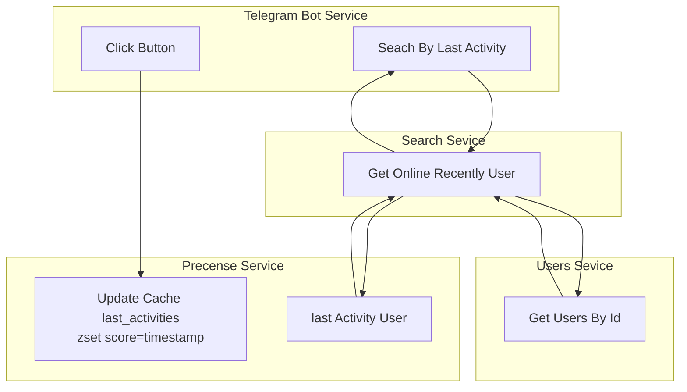

```mermaid
flowchart TD
    subgraph TB[Telegram Bot Service]
        TB_A[Click Button]
        TB_B[Seach By Last Activity]
    end

    subgraph P[Precense Service]
        P_A[Update Cache last_activities<br>zset score=timestamp]
        P_B[last Activity User]
    end

    subgraph S[Search Sevice]
        S_A[Get Online Recently User]
    end

    subgraph U[Users Sevice]
        U_A[Get Users By Id]
    end

    %%Flows
    TB_A --> P_A
    TB_B --> S_A
    S_A --> P_B
    P_B --> S_A
    S_A --> U_A
    U_A --> S_A
    S_A --> TB_B


```
