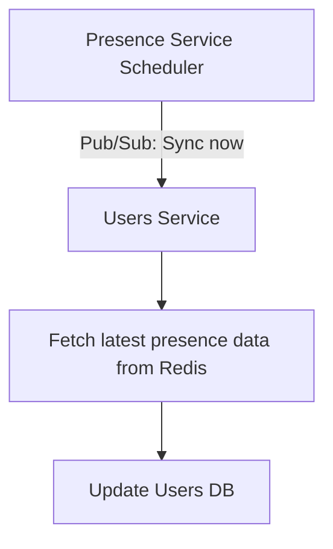

# Presence Service → Users Service Sync Flow

# Pros:

- Separation of concerns: Presence service only tracks cache; Users Service owns DB. 
- Users Service can decide how to process, batch, retry. 
- Scales well: multiple presence instances can publish triggers safely. 

# Cons:

- Users Service must have access to Redis.

---

