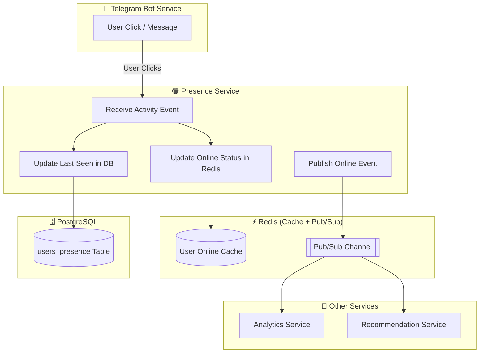

# 🟢 Presence Service Architecture

این دیاگرام معماری میکروسرویسی رو نشون میده که وظیفه **مدیریت وضعیت آنلاین بودن کاربران** و **ذخیره آخرین زمان آنلاین (Last Seen)** رو داره.  
سرویس تلگرام جداست، و این سرویس فقط وظیفه مدیریت آنلاین بودن و اطلاع‌رسانی به سرویس‌های دیگر رو بر عهده دارد.

---

## **Mermaid Diagram**

