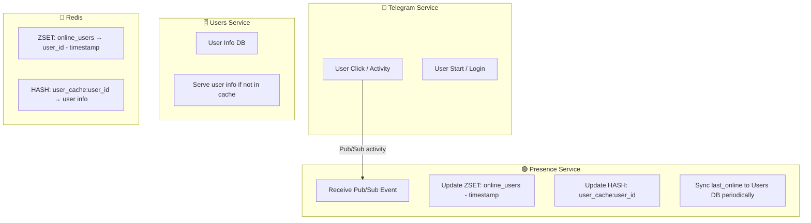

# Online Users Architecture

```mermaid
flowchart TD
    subgraph Telegram["📱 Telegram Service"]
        T1["User Click / Activity"]
        T2["User Start / Login"]
    end

    subgraph Presence["🟢 Presence Service"]
        P1["Receive Pub/Sub Event"]
        P2["Update ZSET: online_users - timestamp"]
        P3["Update HASH: user_cache:user_id"]
        P4["Sync last_online to Users DB periodically"]
    end

    subgraph Users["🗄️ Users Service"]
        U1["User Info DB"]
        U2["Serve user info if not in cache"]
    end

    subgraph Redis["🧰 Redis"]
        R1["ZSET: online_users → user_id - timestamp"]
        R2["HASH: user_cache:user_id → user info"]
    end

    %% User activity flow
    T1 -->|Pub/Sub activity| P1
```
