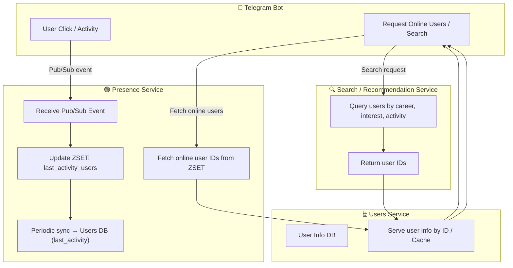

# Refined User Activity & Presence Flow

```mermaid
flowchart TD
    subgraph Telegram["📱 Telegram Bot"]
        T1["User Click / Activity"]
        T2["Request Online Users / Search"]
    end

    subgraph Presence["🟢 Presence Service"]
        P1["Receive Pub/Sub Event"]
        P2["Update ZSET: last_activity_users"]
        P3["Fetch online user IDs from ZSET"]
        P4["Periodic sync → Users DB (last_activity)"]
    end

    subgraph Users["🗄️ Users Service"]
        U1["User Info DB"]
        U2["Serve user info by ID / Cache"]
    end

    subgraph Search["🔍 Search / Recommendation Service"]
        S1["Query users by career, interest, activity"]
        S2["Return user IDs"]
    end

    %% Flows
    T1 -->|Pub/Sub event| P1
    P1 --> P2
    P2 --> P4

    T2 -->|Fetch online users| P3
    P3 --> U2
    U2 --> T2

    T2 -->|Search request| S1
    S1 --> S2
    S2 --> U2
    U2 --> T2
```
