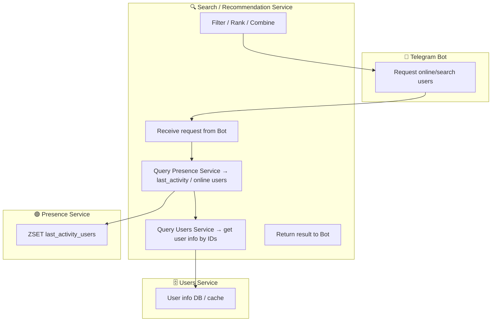

```mermaid
flowchart TD
    subgraph Telegram["📱 Telegram Bot"]
        T1["Request online/search users"]
    end

    subgraph Search["🔍 Search / Recommendation Service"]
        S1["Receive request from Bot"]
        S2["Query Presence Service → last_activity / online users"]
        S3["Query Users Service → get user info by IDs"]
        S4["Filter / Rank / Combine"]
        S5["Return result to Bot"]
    end

    subgraph Presence["🟢 Presence Service"]
        P1["ZSET last_activity_users"]
    end

    subgraph Users["🗄️ Users Service"]
        U1["User info DB / cache"]
    end

    %% Flows
    T1 --> S1
    S1 --> S2
    S2 --> P1
    S2 --> S3
    S3 --> U1
    S4 --> T1
```
