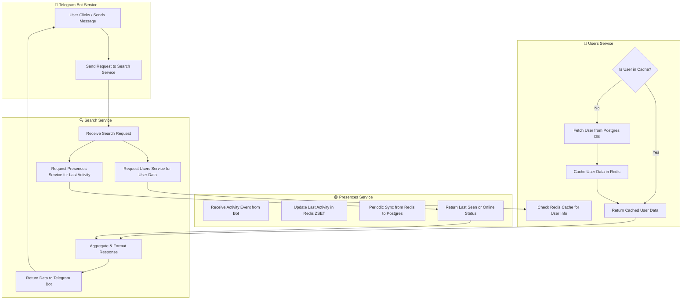

```mermaid
flowchart TD
    subgraph TelegramBot["🤖 Telegram Bot Service"]
        TB1[User Clicks / Sends Message]
        TB2[Send Request to Search Service]
    end

    subgraph SearchService["🔍 Search Service"]
        S1[Receive Search Request]
        S2[Request Presences Service for Last Activity]
        S3[Request Users Service for User Data]
        S4[Aggregate & Format Response]
        S5[Return Data to Telegram Bot]
    end

    subgraph PresencesService["🟢 Presences Service"]
        P1[Receive Activity Event from Bot]
        P2[Update Last Activity in Redis ZSET]
        P3[Periodic Sync from Redis to Postgres]
        P4[Return Last Seen or Online Status]
    end

    subgraph UsersService["👤 Users Service"]
        U1[Check Redis Cache for User Info]
        U2{Is User in Cache?}
        U2 -->|Yes| U3[Return Cached User Data]
        U2 -->|No| U4[Fetch User from Postgres DB]
        U4 --> U5[Cache User Data in Redis]
        U5 --> U3
    end

    %% Flows
    TB1 --> TB2
    TB2 --> S1
    S1 --> S2
    S1 --> S3
    S2 --> P4
    S3 --> U1
    U3 --> S4
    P4 --> S4
    S4 --> S5
    S5 --> TB1

```
