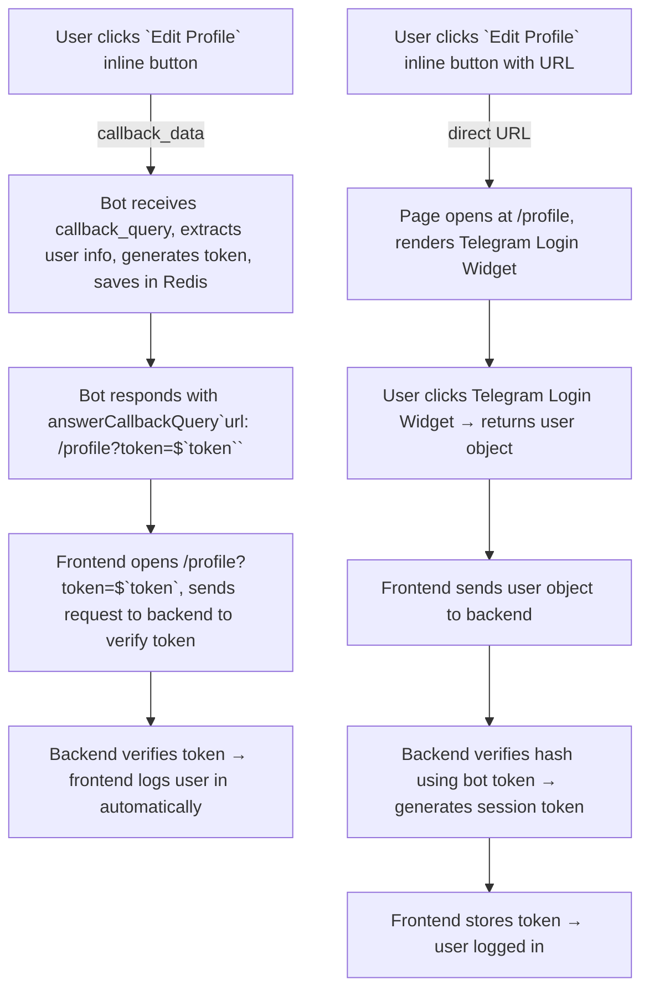

```mermaid
    flowchart TD
        %% Callback_data auto-login flow
        A[User clicks `Edit Profile` inline button] -->|callback_data| B[Bot receives callback_query, extracts user info, generates token, saves in Redis]
        B --> C[Bot responds with answerCallbackQuery`url: /profile?token=$`token``]
        C --> D[Frontend opens /profile?token=$`token`, sends request to backend to verify token]
        D --> E[Backend verifies token → frontend logs user in automatically]

        %% URL + Telegram Login Widget flow
        F[User clicks `Edit Profile` inline button with URL] -->|direct URL| G[Page opens at /profile, renders Telegram Login Widget]
        G --> H[User clicks Telegram Login Widget → returns user object]
        H --> I[Frontend sends user object to backend]
        I --> J[Backend verifies hash using bot token → generates session token]
        J --> K[Frontend stores token → user logged in]
```
