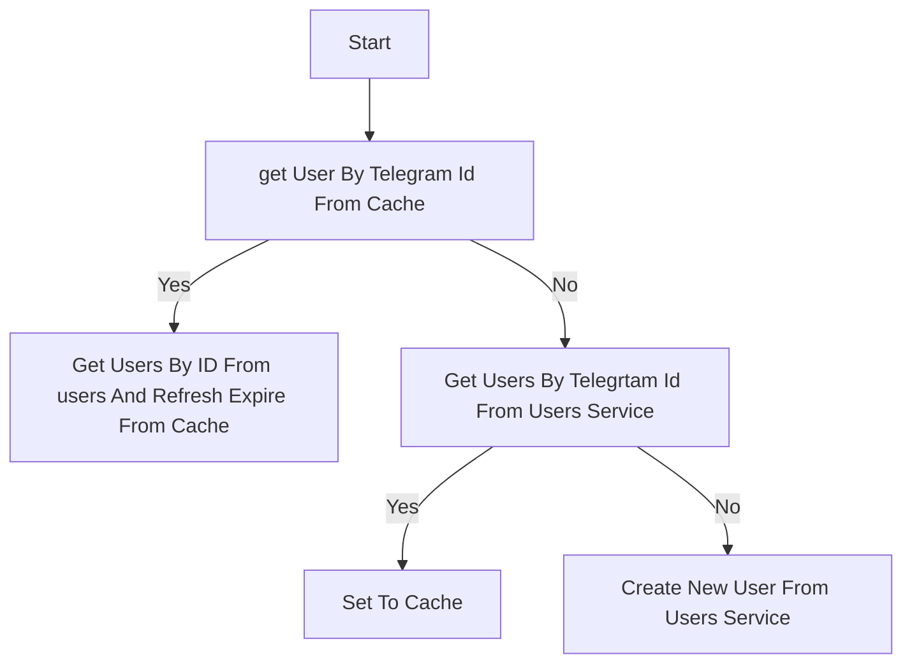

```mermaid
flowchart TD
    A[Start] --> B[get User By Telegram Id From Cache]
    B -->|Yes| C[Get Users By ID From users And Refresh Expire From Cache]
    B -->|No| D[Get Users By Telegrtam Id From Users Service]
    D -->|Yes| E[Set To Cache]
    D -->|No| F[Create New User From Users Service]
```
