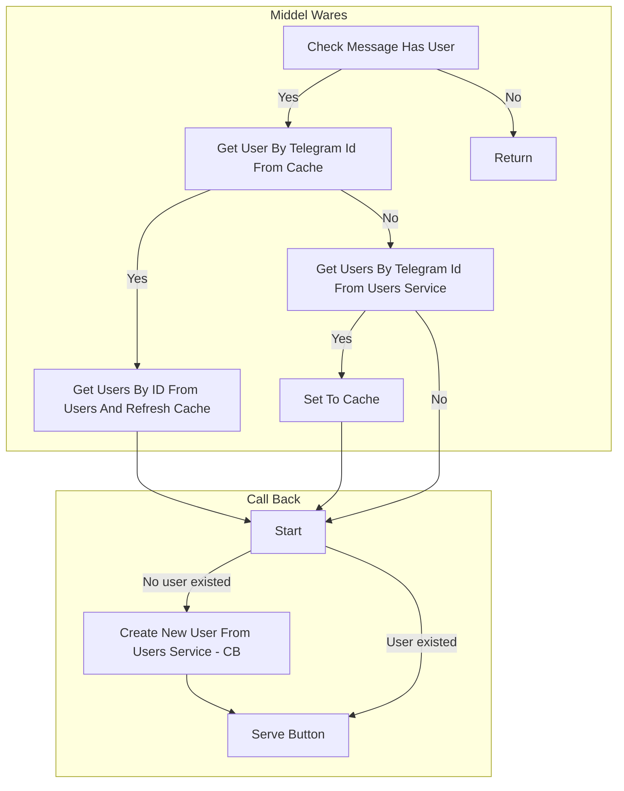

**_When we return in middle ware it causes callback will never be awaited_**

```ts
if (index < middlewares.length) {
  middlewares[index](msg, response, next);
} else {
  await callback(bot, msg, response);
}
```


