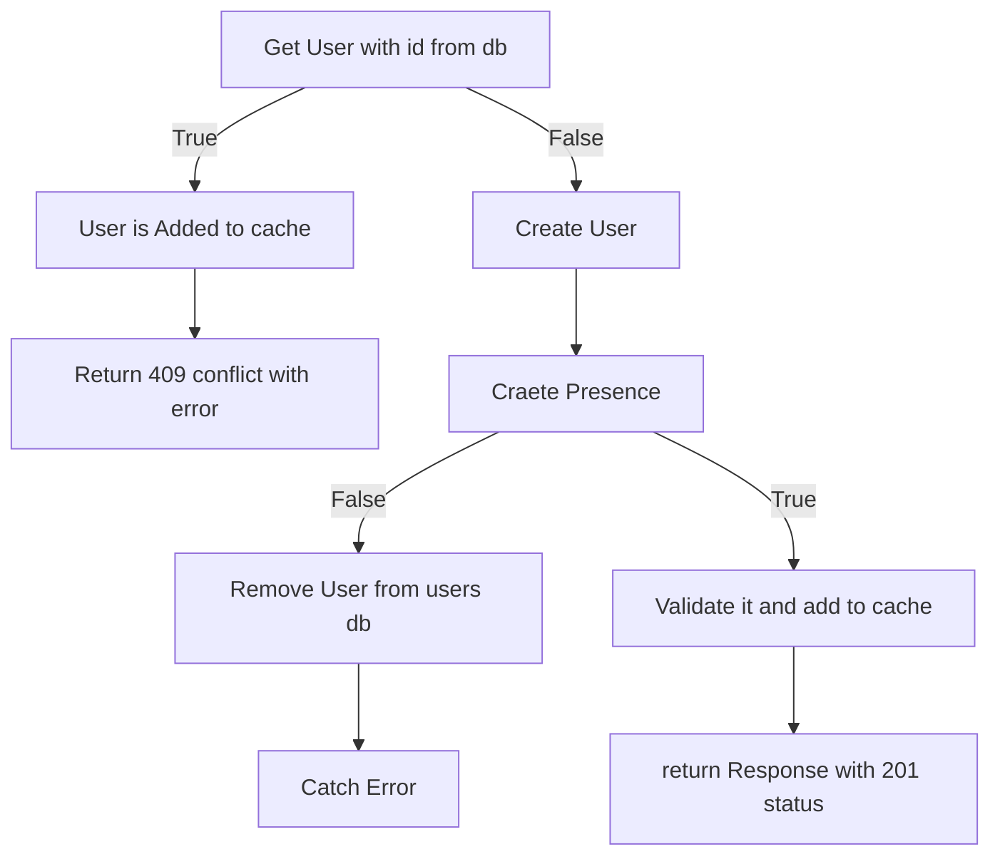

## We use sega architect for transaction

```mermaid
flowchart TD
    A[Get User with id from db] -->|True| B[User is Added to cache]
    B-->H[Return 409 conflict with error]
    A -->|False| C[Create User]
    C -->D[Craete Presence]
    D-->|False| G[Remove User from users db]
    G-->p[Catch Error]
    D-->|True| E[Validate it and add to cache]
    E-->Q[return Response with 201 status]
```
