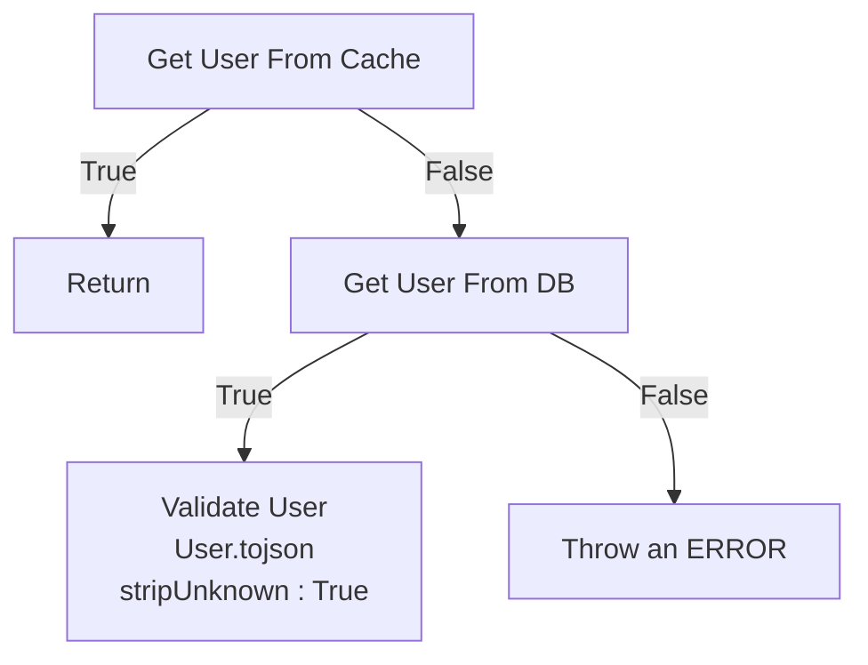

```mermaid
flowchart TD
    A[Get User From Cache] -->|True| B[Return]
    A -->|False| C[Get User From DB]
    C -->|True| D[Validate User <br>User.tojson <br>stripUnknown : True]
    C -->|False| E[Throw an ERROR]
```
